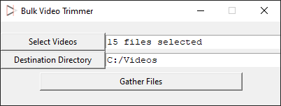
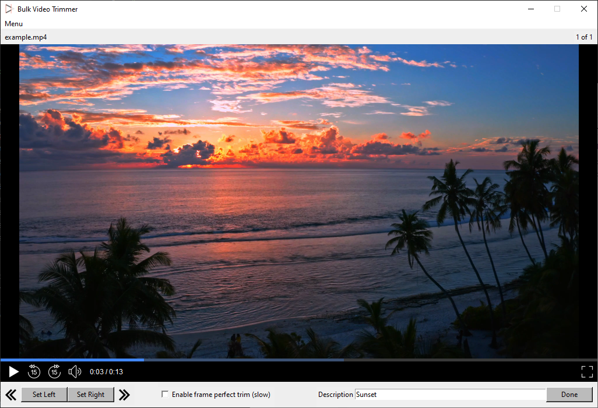
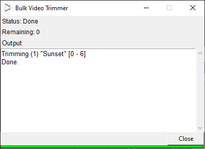

# Bulk Video Trimmer
A video trimmer to be used for multiple video clips in a row.
Features a built-in video player for easy time selection and quick results.

Select videos and output folder:

Select trim locations, play the video back, set fullscreen, add a description:

Descriptive console output:

