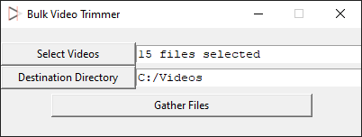
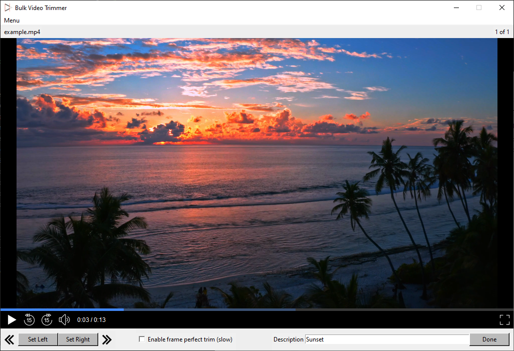
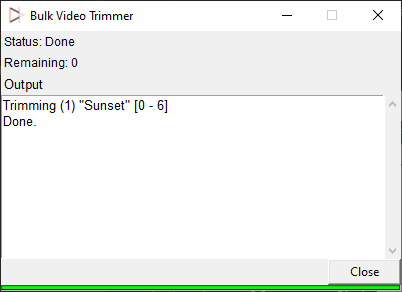

# Bulk Video Trimmer
A video trimmer to be used for multiple video clips in a row.
Features a built-in video player for easy time selection and quick results.

Select videos and output folder:

Select trim locations, play the video back, set fullscreen, add a description:

Descriptive console output:

# Installation
1. Install vlc [recommended version 3.0.18+] (On install, remove all optional settings and change ProgramFile exe name if you don't want to see it)
2. Install python3.11 and add USER\AppData\Local\Programs\Python\Python311 to PATH
3. Use BVTsetup.exe 

OR manually using the following:
pyinstaller --add-data "images;images" -F -w --additional-hooks-dir=. -i images\logo.ico main.py